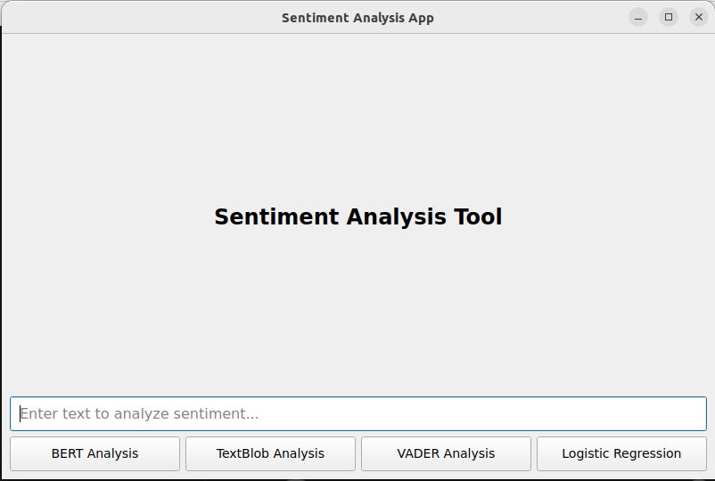
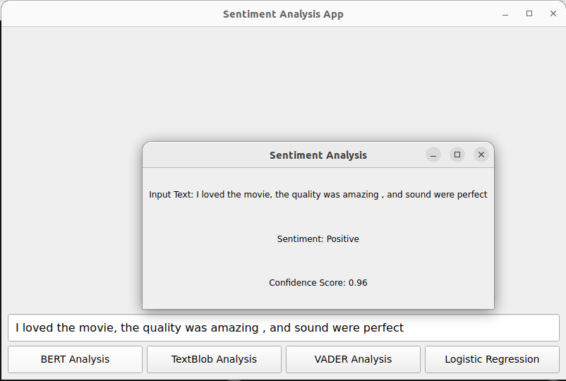
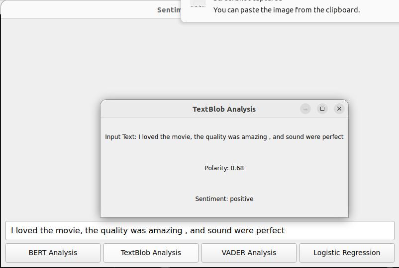
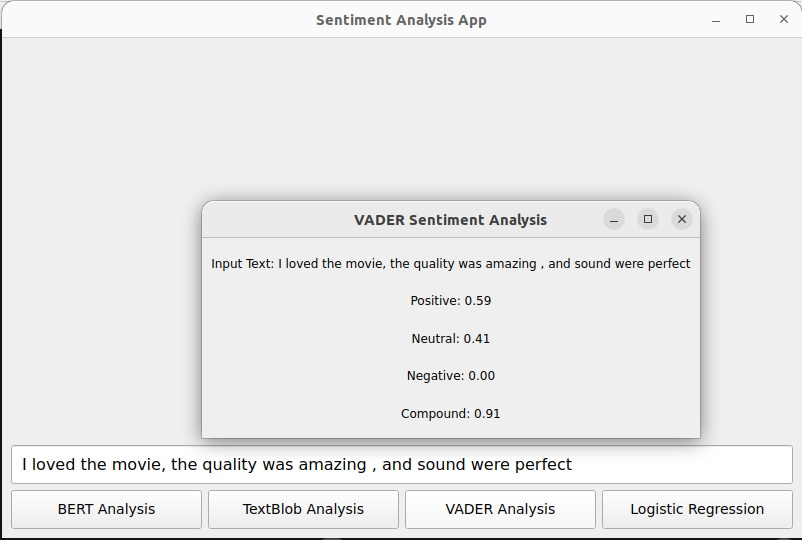

# Sentiment-analysis-with-GUI

This repository is  a college project that includes Logistic Regression, BERT, VADER, TextBlob, and SVM for sentiment analysis, along with a Graphical User Interface (GUI) for easy use. It provides a range of methods to explore sentiment analysis on various text data.

## Usage

1. Open and run the `Sentiment_analysis.ipynb` file to:
   - Generate the models.
   - Explore the dataset.


2. The dataset used is [IMDB Dataset of 50K Movie Reviews]. You can find it at: [https://www.kaggle.com/datasets/lakshmi25npathi/imdb-dataset-of-50k-movie-reviews].

3. Place the generated models into the `Models/` folder.

4. Run the application:
   ```bash
   python3 main.py
   ```

## GUI Screenshots

Here are some screenshots of the GUI in action:






